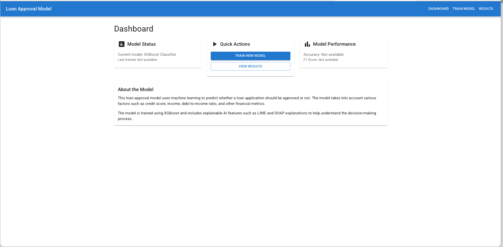
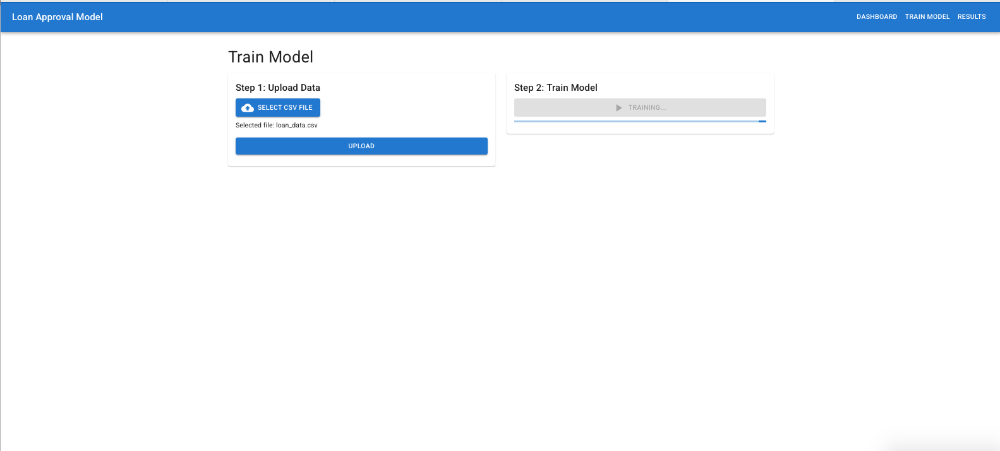
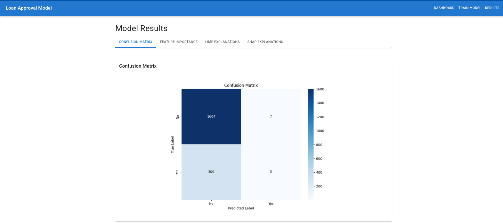
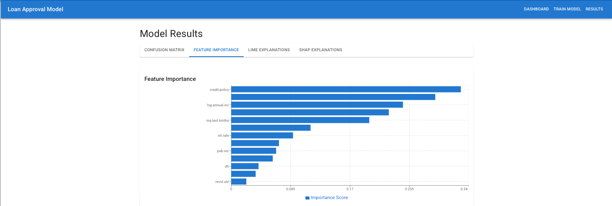
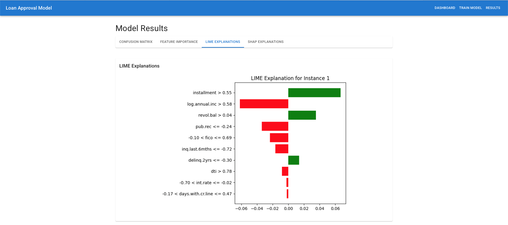
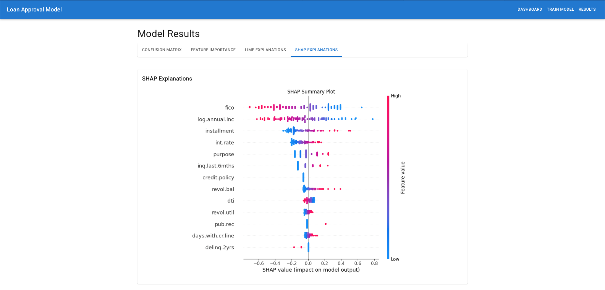

# Loan Approval Model UI

A modern web interface for the Loan Approval Prediction System with Explainable AI (XAI) integration. This UI provides an intuitive way to interact with the loan approval model, visualize results, and understand model decisions through LIME and SHAP explanations.

## Features

- 📊 Interactive Dashboard
- 🔄 Real-time Model Training
- 📈 Comprehensive Model Results
- 🎯 Feature Importance Visualization
- 🔍 LIME & SHAP Explanations
- 💫 Modern Material-UI Design

## Screenshots

### Dashboard

The dashboard provides an overview of the model status, quick actions, and model performance metrics.

### Model Training Interface

Simple two-step process for training the model:
1. Upload your loan data CSV file
2. Start the training process

### Model Results
The results section provides comprehensive insights into the model's performance and decision-making process:

#### Confusion Matrix

Visualizes the model's prediction accuracy and error rates.

#### Feature Importance

Shows the relative importance of each feature in the model's decision-making process.

#### LIME Explanations

Local interpretable model-agnostic explanations for individual predictions.

#### SHAP Values

Global and local feature impact analysis using SHAP (SHapley Additive exPlanations) values.

## Installation

1. Clone the repository:
```bash
git clone https://github.com/KinshukON/LOAN_APPROVAL.git
cd LOAN_APPROVAL/loan_approval_ui
```

2. Install dependencies:
```bash
npm install
```

## Running the Application

The application consists of both frontend and backend servers. We provide simple commands to manage both:

### Starting the Servers

To start both frontend and backend servers simultaneously:
```bash
npm run start:all
```

This will:
- Start the backend server on port 3000
- Start the frontend development server on port 8080
- Enable hot reloading for development

### Stopping the Servers

To stop all running servers:
```bash
npm run stop
```

## Development Scripts

- `npm run start:frontend` - Start only the frontend development server
- `npm run start:backend` - Start only the backend server
- `npm run build` - Create a production build
- `npm run dev` - Start development server with hot reloading

## Project Structure

```
loan_approval_ui/
├── src/                  # Source code
│   ├── components/       # React components
│   ├── pages/           # Page components
│   └── App.js           # Main application component
├── server.js            # Backend server
├── webpack.config.js    # Webpack configuration
└── package.json         # Project dependencies and scripts
```

## API Endpoints

The backend server provides the following API endpoints:

- `POST /api/upload` - Upload training data
- `POST /api/train` - Train the model
- `GET /api/results` - Get model results
- `GET /api/explanations` - Get model explanations

## Technologies Used

- React.js
- Material-UI
- Express.js
- Webpack
- Recharts (for visualizations)
- LIME & SHAP (for model explanations)

## Contributing

Contributions are welcome! Please feel free to submit a Pull Request.

## License

This project is licensed under the MIT License - see the LICENSE file for details.

## Related Blog Series

This UI is part of a comprehensive blog series on Explainable AI. Read more at [Data-Nizant](https://datanizant.com/unlocking-ai-transparency-a-practical-guide-to-getting-started-with-explainable-ai-xai/).

## Support

If you have any questions or face any issues:
- Visit our [blog](https://datanizant.com)
- Submit an issue on GitHub
- Contact through the blog's contact form 